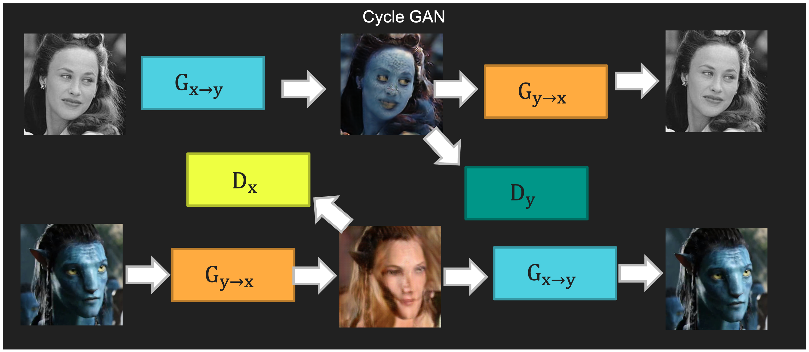
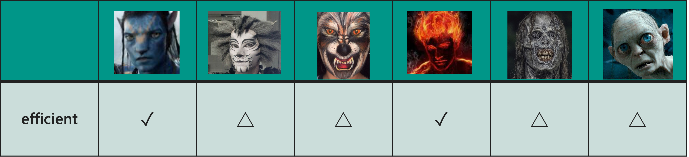

# Face CycleGAN  PyTorch



### Crawler(YouTube)
Use the crawler to grab the face information from [`YouTube`](https://www.youtube.com/)

```
python crawler.py -k <keyword> -f <time>
```

### Face Recognition
[./face_recognition](https://github.com/a07458666/CG_Final_face_gan/tree/main/face_recognition)

### CycleGAN train/test
[./pytorch-CycleGAN-and-pix2pix](https://github.com/a07458666/CG_Final_face_gan/tree/main/pytorch-CycleGAN-and-pix2pix)

### Demo Web
[./CG_Final_Server](https://github.com/a07458666/CG_Final_face_gan/tree/main/CG_Final_Server)

## Related Projects
**[CycleGAN](https://github.com/junyanz/pytorch-CycleGAN-and-pix2pix)**<br>
**[contrastive-unpaired-translation](https://github.com/taesungp/contrastive-unpaired-translation) (CUT)**<br>
**[CycleGAN-Torch](https://github.com/junyanz/CycleGAN) |
[pix2pix-Torch](https://github.com/phillipi/pix2pix) | [pix2pixHD](https://github.com/NVIDIA/pix2pixHD)|
[BicycleGAN](https://github.com/junyanz/BicycleGAN) | [vid2vid](https://tcwang0509.github.io/vid2vid/) | [SPADE/GauGAN](https://github.com/NVlabs/SPADE)**<br>
**[iGAN](https://github.com/junyanz/iGAN) | [GAN Dissection](https://github.com/CSAILVision/GANDissect) | [GAN Paint](http://ganpaint.io/)**