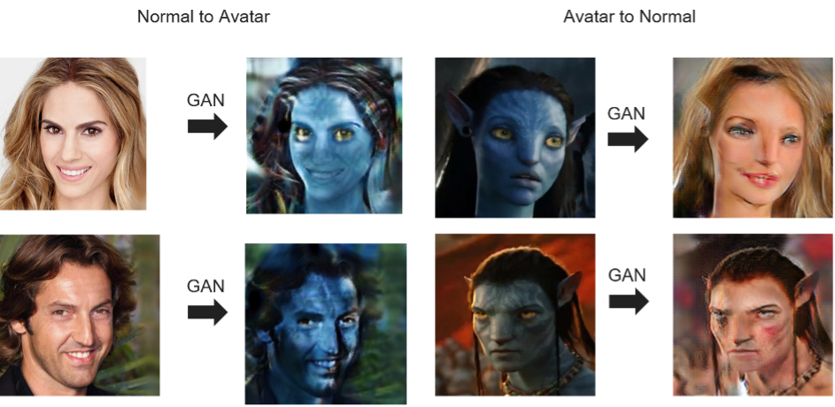

# Face CycleGAN  PyTorch


Fork from [CycleGAN](https://github.com/junyanz/pytorch-CycleGAN-and-pix2pix)

## Prerequisites
- Linux or macOS
- Python 3
- CPU or NVIDIA GPU + CUDA CuDNN

## Getting Started
### Installation

- Clone this repo:
```bash
git clone https://github.com/a07458666/CG_Final_face_gan
cd CG_Final_face_gan
cd pytorch-CycleGAN-and-pix2pix
```

- Install [PyTorch](http://pytorch.org) and 0.4+ and other dependencies (e.g., torchvision, [visdom](https://github.com/facebookresearch/visdom) and [dominate](https://github.com/Knio/dominate)).
  - For pip users, please type the command `pip install -r requirements.txt`.
  - For Conda users, you can create a new Conda environment using `conda env create -f environment.yml`.
  - For Docker users, we provide the pre-built Docker image and Dockerfile. Please refer to our [Docker](docs/docker.md) page.

### CycleGAN train/test

- To view training results and loss plots, run `python -m visdom.server` and click the URL http://localhost:8097.
- To log training progress and test images to W&B dashboard, set the `--use_wandb` flag with train and test script
- Train a model:
```bash
python train.py --dataroot ./datasets/face --name face_cyclegan --model cycle_gan
```
To see more intermediate results, check out `./checkpoints/face_cyclegan/web/index.html`.
- Test the model:
```bash
python test.py --dataroot ./datasets/face --name face_cyclegan --model cycle_gan
```
- The test results will be saved to a html file here: `./results/face_cyclegan/latest_test/index.html`.

### Apply a pre-trained model (CycleGAN)
- You can download a pretrained model (e.g. horse2zebra) with the following script:
```bash
bash ./scripts/download_cyclegan_model.sh horse2zebra
```
- The pretrained model is saved at `./checkpoints/{name}_pretrained/latest_net_G.pth`. Check [here](https://github.com/junyanz/pytorch-CycleGAN-and-pix2pix/blob/master/scripts/download_cyclegan_model.sh#L3) for all the available CycleGAN models.
- To test the model, you also need to download the  horse2zebra dataset:
```bash
bash ./datasets/download_cyclegan_dataset.sh horse2zebra
```

- Then generate the results using
```bash
python test.py --dataroot datasets/horse2zebra/testA --name horse2zebra_pretrained --model test --no_dropout
```
- The option `--model test` is used for generating results of CycleGAN only for one side. This option will automatically set `--dataset_mode single`, which only loads the images from one set. On the contrary, using `--model cycle_gan` requires loading and generating results in both directions, which is sometimes unnecessary. The results will be saved at `./results/`. Use `--results_dir {directory_path_to_save_result}` to specify the results directory.

- For pix2pix and your own models, you need to explicitly specify `--netG`, `--norm`, `--no_dropout` to match the generator architecture of the trained model. See this [FAQ](https://github.com/junyanz/pytorch-CycleGAN-and-pix2pix/blob/master/docs/qa.md#runtimeerror-errors-in-loading-state_dict-812-671461-296) for more details.

## Related Projects
**[CycleGAN](https://github.com/junyanz/pytorch-CycleGAN-and-pix2pix)**<br>
**[contrastive-unpaired-translation](https://github.com/taesungp/contrastive-unpaired-translation) (CUT)**<br>
**[CycleGAN-Torch](https://github.com/junyanz/CycleGAN) |
[pix2pix-Torch](https://github.com/phillipi/pix2pix) | [pix2pixHD](https://github.com/NVIDIA/pix2pixHD)|
[BicycleGAN](https://github.com/junyanz/BicycleGAN) | [vid2vid](https://tcwang0509.github.io/vid2vid/) | [SPADE/GauGAN](https://github.com/NVlabs/SPADE)**<br>
**[iGAN](https://github.com/junyanz/iGAN) | [GAN Dissection](https://github.com/CSAILVision/GANDissect) | [GAN Paint](http://ganpaint.io/)**